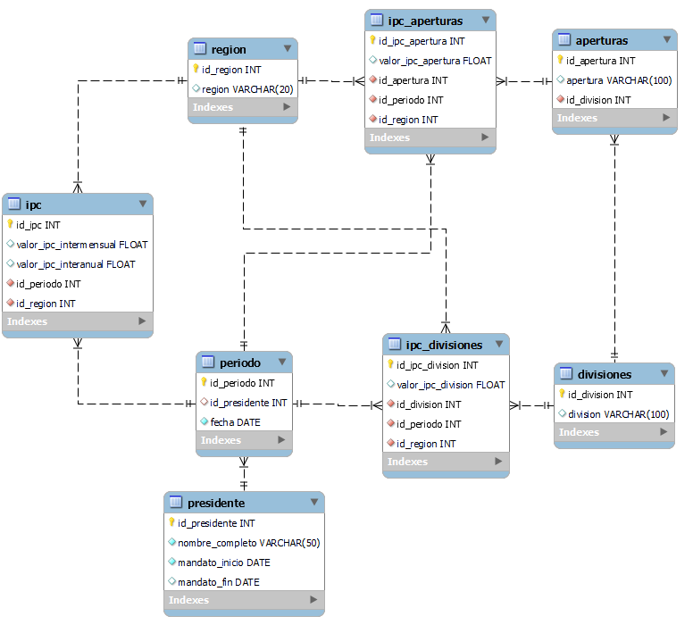

# DB con datos del IPC - Argentina
Bienvenido/a! Esta es una base de datos implementada en MySQL Workbench que contiene información sobre el índice de precios al consumidor (IPC) de Argentina. Los datos son oficiales, según los reportes del INDEC, y contienen registros desde Enero-2017 a Julio-2022.
Para la confección de esta DB, además de la `creación de tablas` e `inserción de registros`, se utilizaron distintas herramientas como `triggers, stored procedures y funciones`. Se crearon distintas `vistas` que resumen la información más relevante de la DB.
Descargá el .zip y echale un vistazo al informe completo:
```
./manual/IPC Schema Handbook.pdf
```

# DER
Diagrama de Entidad-Relación de la base de datos.
